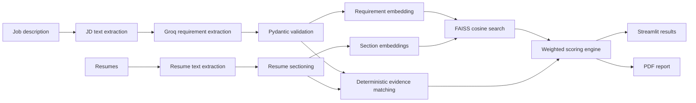

# Semantic Resume Ranking System

*Explainable, section-aware resume ranking with semantic understanding and deterministic evidence scoring.*

[](pyproject.toml)
[](https://streamlit.io/)
[](LICENSE)
[](https://github.com/Muskanbawistale/semantic-resume-ranking-system/actions/workflows/ci.yml)

## Overview

An explainable, section-aware application that ranks resumes against a job description. It uses Groq to extract structured hiring requirements, Sentence Transformers and FAISS to measure contextual alignment, and a deterministic scoring engine to combine semantic and evidence-based signals into an auditable Final Score.

> **Responsible-use note:** This project is decision-support software, not an autonomous hiring system. Candidate rankings should always be reviewed by people and evaluated for bias before real-world use.

## Live Demo

> **Deployment placeholder:(https://semantic-resume-ranking-system.streamlit.app/)

Replace the placeholder with the public deployment URL before publishing the repository.

## Motivation

Resume screening tools often provide a rank without showing how it was produced. Keyword-only systems can miss relevant experience expressed in different language, while fully LLM-generated rankings can be difficult to reproduce, test, or audit. This project separates understanding from decision-making: the LLM extracts requirements, local embeddings compare meaning and context, and transparent code calculates every score.

## Features

- Upload one job description in PDF, DOCX, or TXT format and multiple resumes in PDF or DOCX format.
- Extract the job title, skills, tools, experience, education, certifications, responsibilities, and domains into a validated schema.
- Parse resumes into summary, skills, experience, projects, education, certification, and other sections.
- Calculate section-aware Conceptual Match using local Sentence Transformer embeddings and exact FAISS cosine search.
- Match skills and tools with case-insensitive, boundary-aware patterns and a focused alias layer.
- Produce a deterministic Final Score with fixed, documented component weights.
- Show matched and missing skills, matched tools and certifications, strengths, improvement areas, project evidence, and component scores.
- Rank multiple candidates and generate a downloadable PDF report.
- Surface malformed-file and low-text-density warnings without silently ranking unusable documents.
- Process uploaded files in memory without application-level document persistence.

## Example Output

The following assets are reserved for real screenshots captured from the working application. No generated or mock screenshots are included.

| View | Future screenshot |
|---|---|
| Home Page | `docs/screenshots/home-page.png` |
| Upload Documents | `docs/screenshots/upload-documents.png` |
| Ranking Results | `docs/screenshots/ranking-results.png` |
| Candidate Details | `docs/screenshots/candidate-details.png` |
| PDF Report | `docs/screenshots/pdf-report.png` |

## System Architecture



Groq is restricted to requirement extraction. It does not assign candidate scores or determine the final ranking. Only job-description text is sent to Groq; resume parsing, embedding generation, evidence matching, and scoring run within the application environment. See [Architecture and Design Decisions](docs/architecture.md) for additional context.

## Technology Stack

| Technology | Purpose | Why it was chosen |
|---|---|---|
| Python 3.10–3.12 | Application and scoring logic | Mature AI/data ecosystem and clear support for typed, testable services |
| Streamlit | Interactive upload and results interface | Enables a focused data application without a separate frontend stack |
| Groq API | Structured job-requirement extraction | Supports JSON Schema output while keeping the LLM outside ranking decisions |
| Pydantic | Requirement and result validation | Enforces explicit schemas and dependable downstream data |
| Sentence Transformers | Local text embeddings | Captures contextual similarity beyond exact keyword overlap |
| `all-mpnet-base-v2` | Default embedding model | Offers a practical quality-versus-complexity balance for local inference |
| FAISS CPU | Exact cosine retrieval | `IndexFlatIP` is deterministic, transparent, and suitable for small in-memory section sets |
| PyMuPDF and python-docx | PDF and DOCX extraction | Provide dependable text extraction with a modest dependency footprint |
| Pandas | Ranked tables and chart input | Integrates directly with Streamlit's data components |
| ReportLab | PDF report generation | Creates portable recruiter-facing reports without an external service |
| pytest, Ruff, GitHub Actions | Automated quality checks | Keeps scoring helpers and matching behavior testable on every push and pull request |

## Project Structure

```text
semantic-resume-ranking-system/
├── .github/workflows/ci.yml      # Lint and test workflow
├── .streamlit/config.toml        # Streamlit theme and upload configuration
├── app/streamlit_app.py          # Presentation layer
├── docs/
│   ├── screenshots/             # Future application screenshots
│   ├── architecture.md          # Architecture and design decisions
│   └── interview_guide.md       # Technical interview preparation
├── src/
│   ├── config/                   # Environment-backed settings
│   ├── document_processing/      # Extraction and resume sectioning
│   ├── domain/                   # Pydantic domain models
│   ├── embeddings/               # Sentence Transformer adapter
│   ├── llm/                      # Groq requirement extraction
│   ├── ranking/                  # Matching and deterministic scoring
│   ├── reporting/                # PDF report generation
│   ├── search/                   # FAISS cosine index
│   ├── utils/                    # Shared text utilities
│   └── service.py                # Analysis workflow orchestration
├── tests/                        # Unit tests
├── .env.example                  # Safe configuration template
├── pyproject.toml                # Package metadata and tooling configuration
└── requirements.txt              # Runtime dependencies
```

See the [Architecture and Design Decisions](docs/architecture.md) and [Technical Interview Guide](docs/interview_guide.md) for deeper implementation context.

## Installation

### Prerequisites

- Python 3.10, 3.11, or 3.12
- A Groq API key

```bash
git clone https://github.com/Muskanbawistale/semantic-resume-ranking-system.git
cd semantic-resume-ranking-system
python -m venv .venv
```

Activate the virtual environment:

```powershell
# Windows PowerShell
.venv\Scripts\Activate.ps1
```

```bash
# macOS or Linux
source .venv/bin/activate
```

Install the runtime dependencies:

```bash
python -m pip install --upgrade pip
pip install -r requirements.txt
```

## Environment Variables

Copy the committed template to a local `.env` file:

```powershell
# Windows PowerShell
Copy-Item .env.example .env
```

```bash
# macOS or Linux
cp .env.example .env
```

The template contains:

```env
GROQ_API_KEY=replace_with_your_key
GROQ_MODEL=openai/gpt-oss-120b
EMBEDDING_MODEL=sentence-transformers/all-mpnet-base-v2
MAX_FILE_SIZE_MB=10
```

| Variable | Required | Description |
|---|:---:|---|
| `GROQ_API_KEY` | Yes | API key used for job-description requirement extraction |
| `GROQ_MODEL` | No | Groq model ID; defaults to `openai/gpt-oss-120b` |
| `EMBEDDING_MODEL` | No | Sentence Transformer model used for local embeddings |
| `MAX_FILE_SIZE_MB` | No | Maximum accepted document size in megabytes; defaults to `10` |

The local `.env` file is ignored by Git. Keep `.env.example` free of real credentials.

## Running the Application

```bash
streamlit run app/streamlit_app.py
```

Open `http://localhost:8501`, upload one job description and at least one resume, then select **Analyze and rank**. The embedding model is downloaded on first use if it is not already available locally.

For local quality checks:

```bash
pip install -e ".[dev]"
ruff check .
pytest -q
```

## How the Ranking Pipeline Works

1. **Extract documents:** PyMuPDF, python-docx, or UTF-8 text decoding converts supported files into cleaned text.
2. **Structure the job description:** Groq returns hiring requirements that must pass the `HiringRequirements` Pydantic schema.
3. **Section resumes:** Heuristics identify skills, experience, projects, education, certifications, summaries, and uncategorized content.
4. **Create embeddings:** The job requirements and each detected resume section are embedded locally.
5. **Calculate semantic components:** FAISS compares normalized vectors with cosine similarity. Available section scores are combined into Conceptual Match using fixed relative weights, renormalized when sections are missing. Project relevance uses the projects-section score and falls back to Conceptual Match when no projects section is detected.
6. **Collect evidence signals:** Deterministic functions calculate skill coverage, experience, education, certifications, and lexical overlap.
7. **Calculate Final Score:** The component values are combined using the documented weights below and converted to a 0–100 score.
8. **Rank and explain:** Candidates are sorted by Final Score and presented with evidence, gaps, component scores, and a PDF report.

## Conceptual Match vs. Final Score

| Measure | What it represents | How it is used |
|---|---|---|
| **Conceptual Match** | How closely the meaning and context of a resume align with the job requirements, based on section-level embeddings and cosine similarity | One 0–100 component contributing 30% of the Final Score |
| **Final Score** | The complete evidence-based ranking score across all implemented signals | The 0–100 weighted result used to order candidates |

Conceptual Match can recognize related responsibilities even when wording differs, but it does not determine the ranking by itself. Final Score also considers explicit qualifications and evidence:

```text
Final Score = 30% Conceptual Match
            + 25% required skill coverage
            + 12% experience match
            +  8% preferred skill coverage
            +  8% project relevance
            +  7% education match
            +  5% certification match
            +  5% lexical overlap
```

The weights are transparent defaults, not validated hiring policy. They should be calibrated against recruiter-labeled evaluation data before production use.

## Explainability Features

- Validated hiring requirements are visible in the interface.
- Ranked tables expose Final Score, Conceptual Match, required-skill coverage, experience, and project relevance.
- Candidate views identify matched and missing required skills.
- Tools, certifications, strengths, improvement areas, and relevant project excerpts are shown when available.
- A score-breakdown chart displays every component used by the scoring engine.
- A downloadable PDF summarizes rankings, scores, strengths, and missing requirements.
- Processing warnings identify malformed, empty, or low-text-density documents.

## Current Limitations

- Image-only or scanned PDFs require OCR, which is not implemented.
- Resume section detection is heuristic and may miss unconventional layouts.
- Experience estimation primarily uses explicit statements such as “3 years” rather than reconstructing employment date ranges.
- Skill aliases are intentionally limited and are not a complete, versioned skill ontology.
- The default scoring weights have not been calibrated on recruiter-labeled outcomes.
- Extracted `preferred_years` and `nice_to_have` fields are not separate scoring signals.
- Groq access and a valid model ID are required for job-description extraction.
- Uploaded documents and computed embeddings are not persisted between application sessions.
- Human review and bias auditing remain necessary; the system cannot infer candidate quality perfectly.

## Future Improvements

- Add an OCR adapter for image-only resumes.
- Build a recruiter-labeled evaluation set and report ranking metrics such as NDCG@k.
- Expand and version the skill ontology and alias catalog.
- Calculate experience from employment date ranges while handling overlap.
- Cache document hashes and embeddings across sessions.
- Benchmark optional top-candidate reranking before introducing additional models.
- Add fairness dashboards and audit logs.

## License

This project is available under the [MIT License](LICENSE).

## Why This Project Is Different

This system combines **semantic understanding** with **deterministic ranking** and visible evidence. The LLM structures the job description but never decides who ranks first; every Final Score comes from fixed, inspectable code. Recruiters can see not only the ordering, but also the contextual match, explicit strengths, and missing requirements behind it—making explainable AI a core design property rather than an afterthought.
