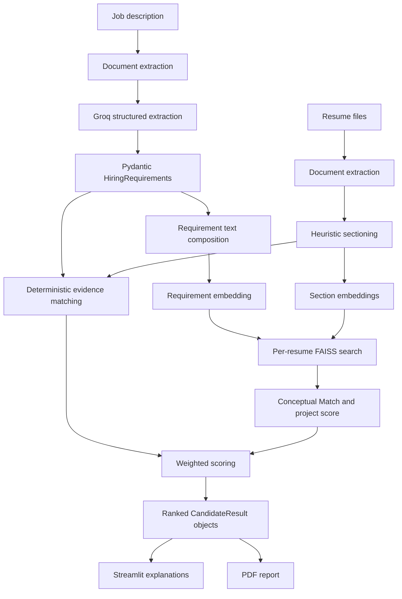

# Architecture and Design Decisions

This document describes the system as implemented. The application is a local Streamlit workflow with one external dependency in the analysis path: Groq is used to convert job-description text into structured requirements. Candidate scoring and ranking remain in application code.

## Design Goals

- Separate language-model extraction from ranking decisions.
- Combine contextual similarity with explicit, auditable evidence.
- Preserve section-level resume context instead of embedding an entire document as one block.
- Keep scoring reproducible once requirements, document text, and embeddings are fixed.
- Surface evidence and processing failures rather than returning an unexplained rank.
- Operate without a database or application-level document persistence.

## Data Flow



The job-description and resume paths are intentionally separate. Only job-description text is sent to Groq. Resume parsing, embedding generation, matching, scoring, and report generation run within the application environment.

## Component Responsibilities

| Component | Location | Responsibility |
|---|---|---|
| Streamlit application | [`app/streamlit_app.py`](../app/streamlit_app.py) | File upload, validation messages, ranked tables, candidate evidence, charts, and report download |
| Analysis service | [`src/service.py`](../src/service.py) | Coordinates extraction, requirement parsing, resume sectioning, ranking, and per-resume warnings |
| Document extractor | [`src/document_processing/extractor.py`](../src/document_processing/extractor.py) | Reads PDF, DOCX, and TXT content; enforces file-size and minimum-text checks |
| Resume sectioner | [`src/document_processing/sectioner.py`](../src/document_processing/sectioner.py) | Detects sections, estimates explicit years of experience, and derives display metadata |
| Requirement extractor | [`src/llm/groq_requirements.py`](../src/llm/groq_requirements.py) | Requests strict JSON Schema output from Groq and validates it as `HiringRequirements` |
| Embedding adapter | [`src/embeddings/encoder.py`](../src/embeddings/encoder.py) | Creates normalized Sentence Transformer vectors |
| FAISS adapter | [`src/search/faiss_index.py`](../src/search/faiss_index.py) | Performs exact inner-product search over one resume's section vectors |
| Matcher and scorer | [`src/ranking/`](../src/ranking) | Applies boundary-aware term matching and calculates all score components |
| PDF reporter | [`src/reporting/pdf_report.py`](../src/reporting/pdf_report.py) | Produces the in-memory downloadable ranking report |

## LLM Boundary

Groq performs one narrow task: extracting factual hiring requirements from the job description. The request uses temperature `0`, limits the submitted description to 30,000 characters, and requires strict JSON Schema output. Pydantic validates the response structure and constraints—not its factual correctness—before ranking begins, and the extractor makes at most two attempts.

The model does **not** see resumes, assign candidate scores, or determine rank order. Temperature `0` reduces variability but does not make an external model call mathematically deterministic. The deterministic claim applies to the downstream scoring rules when their inputs are fixed.

## Document Processing

The extractor accepts PDF, DOCX, and TXT documents. The Streamlit interface allows PDF, DOCX, or TXT for the job description and PDF or DOCX for resumes. Files are rejected when they are empty, exceed `MAX_FILE_SIZE_MB`, use an unsupported extension, or produce fewer than 80 characters of text.

PDFs with low text density receive an OCR warning. OCR itself is not implemented. A malformed resume produces a warning and does not stop other resumes from being evaluated; analysis fails if no valid resumes remain.

Resume section detection is rule-based. Content is grouped into summary, skills, experience, projects, education, certifications, or other. Explicit experience is estimated from statements such as `3 years`; employment date ranges are not reconstructed.

## Conceptual Match

Conceptual Match measures contextual alignment between structured job requirements and resume sections.

1. A query is composed from the role, required and preferred skills, tools, responsibilities, domains, and relevant experience areas. Minimum years, education, certifications, and `nice_to_have` are not included in this embedding query.
2. The query and every detected resume section are embedded with the configured Sentence Transformer model.
3. Vectors are L2-normalized. `IndexFlatIP` inner product therefore equals cosine similarity.
4. A fresh FAISS index is built for each resume's small set of section vectors.
5. Each cosine value is calibrated to an interpretable `0–1` range:

```text
calibrated = clamp((cosine - 0.20) / 0.60, 0, 1)
```

6. Calibrated section scores are combined using relative coefficients. Coefficients are renormalized over the section categories present in that resume.

| Resume section | Relative coefficient |
|---|---:|
| Experience | 0.35 |
| Skills | 0.25 |
| Projects | 0.20 |
| Education | 0.08 |
| Certifications | 0.07 |
| Summary | 0.05 |
| Other | 0.05 |

These are relative coefficients rather than standalone percentages; together they sum to `1.05` before presence-based normalization. Project relevance is the calibrated projects-section score. If no projects section is detected, the implementation falls back to the overall Conceptual Match value.

## Deterministic Evidence Signals

The matcher uses escaped, case-insensitive regular expressions with custom alphanumeric boundaries. A focused alias map covers ambiguous or punctuated skills such as R, C, C++, C#, Go, .NET, Node.js, and React.js, alongside common abbreviations such as AWS, ML, and NLP. This avoids substring errors such as matching `R` inside `researcher`.

| Signal | Implemented behavior |
|---|---|
| Required skill coverage | Matched required skills divided by expected required skills |
| Preferred skill coverage | Matched preferred skills divided by expected preferred skills |
| Experience match | Explicit resume years divided by minimum required years, capped at `1.0` |
| Education match | 60% education-level match plus 40% field coverage |
| Certification match | Matched certifications divided by expected certifications |
| Lexical overlap | Token overlap across required skills, tools, and domains; any matching token can satisfy a multiword term |

An unspecified requirement does not penalize a candidate: empty coverage lists, no minimum experience, and no education requirement receive a neutral/full component value of `1.0`. These constants do not change relative ordering within one job description, but they can raise absolute scores. Education matching is term-based; it does not implement a degree hierarchy. Extracted `preferred_years` and `nice_to_have` values do not currently contribute separate score components.

## Final Score

All internal components are calculated on a `0–1` scale. The weighted result is multiplied by 100 and rounded to one decimal place.

```text
Final Score = 30% Conceptual Match
            + 25% required skill coverage
            + 12% experience match
            +  8% preferred skill coverage
            +  8% project relevance
            +  7% education match
            +  5% certification match
            +  5% lexical overlap
```

Candidates are sorted by Final Score in descending order. These weights are documented product defaults, not a validated hiring policy.

## Explainability and Outputs

The application exposes the validated requirements, ranking table, candidate summary, matched and missing skills, tools, certifications, strengths, improvement areas, score breakdown, and qualifying project excerpts. The PDF report contains the ranking table plus per-candidate summaries, strengths, improvement areas, and missing requirements.

Explanations are generated from fixed thresholds and matched evidence. They are not free-form LLM explanations.

## Design Trade-offs

| Decision | Benefit | Trade-off |
|---|---|---|
| LLM extraction only | Keeps rank calculation inspectable and testable | Upstream requirements still depend on an external model |
| Section-level embeddings | Preserves evidence by resume category | Requires more embedding operations than one whole-document vector |
| Exact FAISS search | Simple and reproducible for small section sets | The current per-resume index is not an optimized batch-retrieval design |
| Fixed weighted scoring | Easy to audit and explain | Weights require validation and calibration on labeled data |
| In-memory processing | Minimal infrastructure and no application database | Results and computed embeddings are not persisted between sessions |

## Privacy and Responsible Use

Uploaded files are processed in memory by the application, but job-description text is transmitted to Groq. API credentials are loaded from a local `.env` file and must not be committed.

The project does not implement protected-attribute detection, redaction, subgroup fairness evaluation, or a bias guarantee. Resume text may contain names and other proxies. Production use would require governance, representative evaluation data, privacy review, bias testing, and meaningful human oversight.

## Current Limitations

- No OCR for image-only PDFs.
- Heuristic section and experience extraction.
- Small, manually defined skill alias catalog.
- No recruiter-labeled calibration or ranking benchmark.
- No persistence, authentication, API, audit log, or fairness dashboard.
- Dependence on Groq availability and model access for requirement extraction.
- No claim of production readiness or autonomous hiring suitability.

## Quality Checks

The GitHub Actions workflow installs the development extras and runs:

```bash
ruff check .
pytest -q
```

Unit tests cover strict requirement schemas, section parsing, score helpers, and boundary-aware skill matching.
